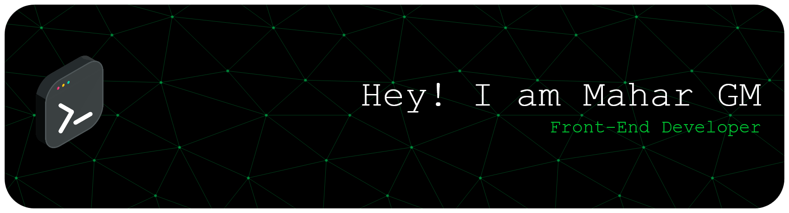

<h3 align="center">A passionate frontend developer from Pakistan</h3>

  

## 🌐 Socials:
    

# 💻 Tech Stack:
         
# 📊 GitHub Stats:
 
 

## 🏆 GitHub Trophies

### ✍️ Random Dev Quote

### 🔝 Top Contributed Repo

---

  ## 💰 You can help me by Donating
    

  
<!-- Proudly created with GPRM ( https://gprm.itsvg.in ) -->
